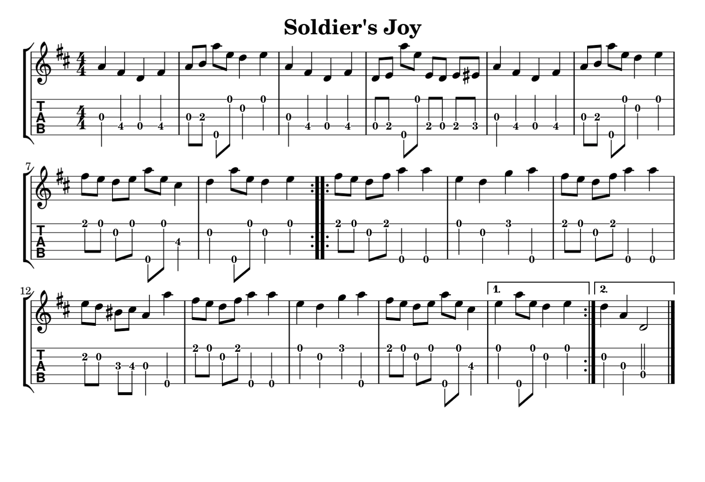

# Introduction

[lilypond](http://lilypond.org) is a powerful system for typesetting beautiful music.

As a banjo player I sometimes want to transcribe a piece into notation and/or tablature.  Not
being an expert at converting from string+fret positions on the banjo into standard notation,
I wanted to be able to enter music by giving string+fret together with tuning information to lilypond.

This code is a preprocessor for lilypond files that converts string+fret information into
standard notation that can be typeset in lilypond.

## Example

Here is an example of the A part of [Matt Brown's](http://twofingerbanjo.com) two-finger banjo tab
for Soldier's Joy written  in this simplified notation.


> %!DoubleC
>2.0.4 3.4.4 3.0.4 3.4.4
>2.0.8 2.2.8 4.0.8 0.0.8 1.0.4 0.0.4
>2.0.4 3.4.4 3.0.4 3.4.4
>3.0.8 3.2.8 4.0.8 0.0.8 3.2.8 3.0.8 3.2.8 3.3.8
>2.0.4 3.4.4 3.0.4 3.4.4
>2.0.8 2.2.8 4.0.8 0.0.8 1.0.4 0.0.4
>0.2.8 0.0.8 1.0.8 0.0.8 4.0.8 0.0.8 2.4.4
>1.0.4 4.0.8 0.0.8 1.0.4 0.0.4
>!%

The %! is a flag telling the preprocessor to translate up to the end tag !%.
The DoubleC notation says that the tab info should be interpreted in that tuning.
This only needs to be specified once; further %! -- !% sections will use the same tuning
unless there's an explicit change.  Options are OpenG, DoubleC, Modal (for sawmill tuning). 

Each note is entered as (string).(fret).(duration).  To 2.0.4 means a quarter note on
the open second string.  NOTE THAT STRINGS ARE COUNTED FROM ZERO like in python, so 
the "5th string" drone is string number 4 in the above.

The result of running the preprocessor on this input is the lilypond string

> g'4\3 e'4\4 c'4\4 e'4\4 g'8\3 a'8\3 g''8\5 d''8\1 c''4\2 d''4\1 g'4\3 e'4\4 c'4\4 e'4\4 c'8\4 d'8\4 g''8\5 d''8\1 d'8\4 c'8\4 d'8\4 dis'8\4 g'4\3 e'4\4 c'4\4 e'4\4 g'8\3 a'8\3 g''8\5 d''8\1 c''4\2 d''4\1 e''8\1 d''8\1 c''8\2 d''8\1 g''8\5 d''8\1 b'4\3 c''4\2 g''8\5 d''8\1 c''4\2 d''4\1 

In the included files, the lilypond file with interpolated string/fret format is
```soldiers_joy.rly```.  The generated lilypond file is ```soldiers_joy.ly```.
It was produced by running

```bash
$ parse2 soldiers_joy.rly > soldiers_joy.ly
```

The preprocessor recognizes lilypond ties (~), slurs (parentheses), and beams (brackets).
Chords can be entered using <>:

> <0.2 1.1>4 is a quarter note chord on the 0th string second fret and the first string, first fret.

## Examples





